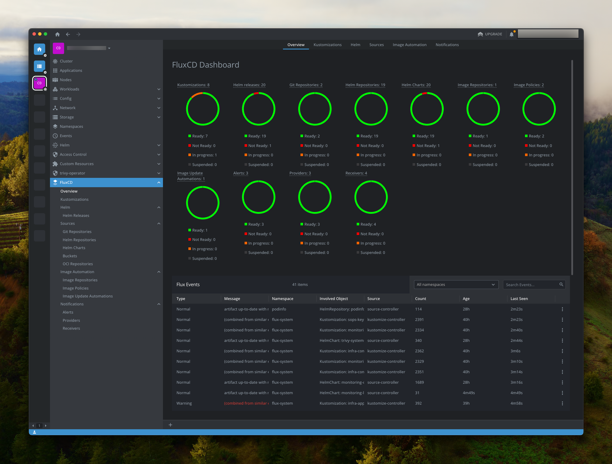
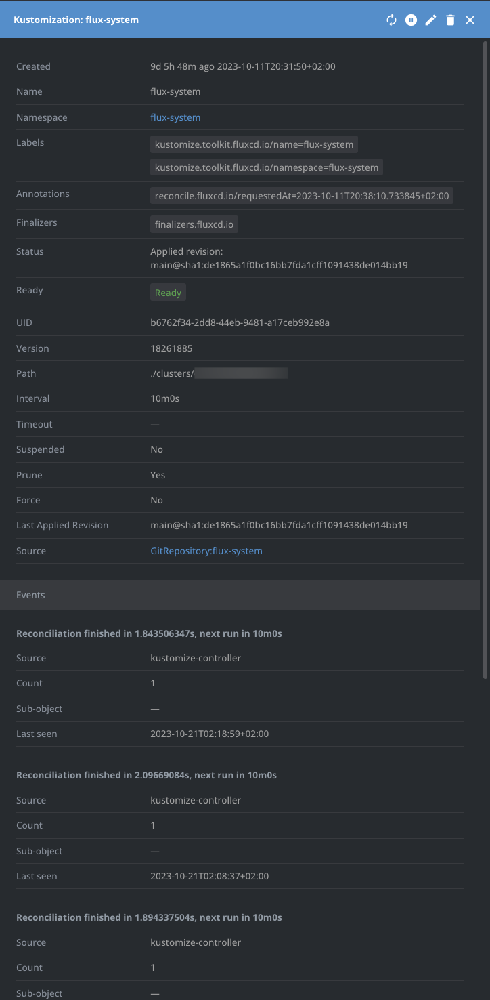

# Lens FluxCD Extension

Add FluxCD support to Lens. https://fluxcd.io/

The following features are available:

* Dashboard of all FluxCD Application components and Events.
* Resource menus to reconcile, sync, and automate FluxCD resources.
* Show extended details for FluxCD resources.

## Screenshots

Dashboard


Details


Events


## Install

To install open K8s Lens and go to Extensions (CTRL+SHIFT+E or CMD+SHIFT+E), and install `lens-extension-fluxcd`.

or

Click on the following link [lens://app/extensions/install/lens-extension-fluxcd](lens://app/extensions/install/lens-extension-fluxcd)

## Development

To install the extension for development

```sh
mkdir -p ~/.k8slens/extensions
git clone https://github.com/okaufmann/lens-extension-fluxcd.git
ln -s $(pwd) ~/.k8slens/extensions/lens-extension-fluxcd
```

Or you can open the Extensions view in Lens and click "Install from URL..." and paste the following:

```
lens-extension-fluxcd
```

## Build

To build the extension you can use `make` or run the `npm` commands manually:

```sh
make build
```

OR

```sh
npm install
npm run build
```

If you want to watch for any source code changes and automatically rebuild the extension you can use:

```sh
npm run start
```

## Test

Open the Lens application and navigate to a cluster. You should see "FluxCD" dashboard in a cluster menu.

## Uninstall

```sh
rm ~/.k8slens/extensions/lens-extension-fluxcd
```

Restart Lens application.
